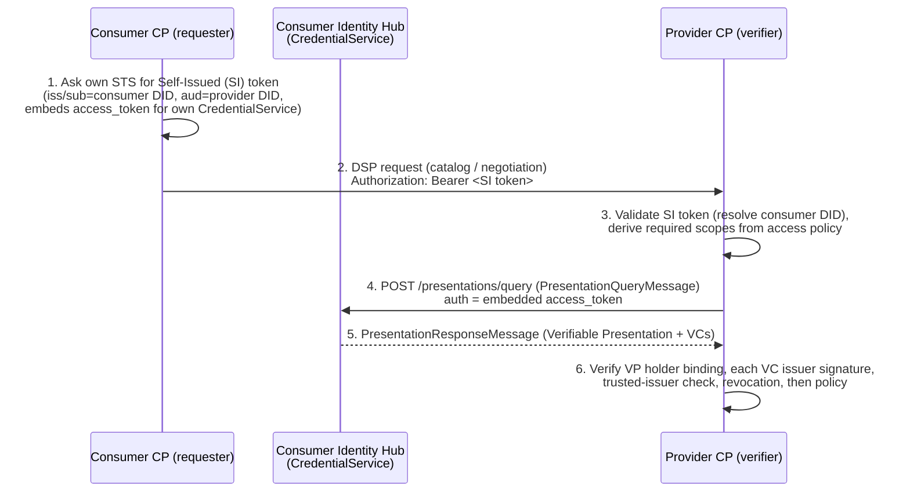
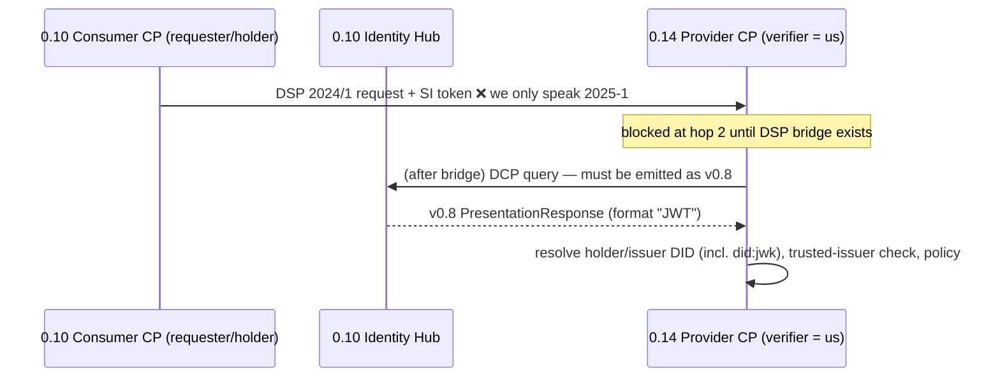
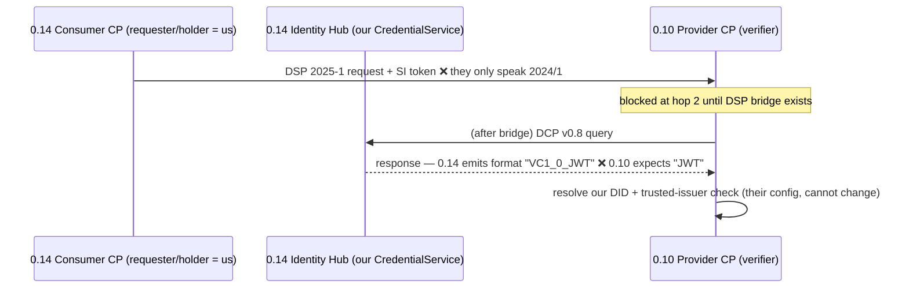

# Credential validation across an EDC 0.10 ⇄ 0.14 version boundary

**Status:** Specification / analysis
**Scope:** How Verifiable-Credential validation is initiated and completed between a
**frozen EDC 0.10 dataspace** (the "EMDS" side) and **our EONA-X connector on EDC 0.14**,
in both directions, **assuming no change can be made on the 0.10 side**.

All remediation described here lands on the **0.14 side only**.

---

## 1. Constraint and what "initiating a validation" means

The 0.10 peer cannot be modified: not its DSP version, not its DCP context, not its
credential format, not its DID methods. Every adaptation is on our 0.14 connector.

In EDC, **credential validation is never a standalone call**. It is a side effect of a
Dataspace Protocol (DSP) interaction — catalog request, contract negotiation, or transfer.
The flow always has two roles:

- **Verifier (relying party):** the connector that receives a DSP request and must check
  the counterparty's credentials before proceeding.
- **Holder (prover):** the connector whose credentials are being checked. It exposes a
  **CredentialService Presentation API** (the Identity Hub) that the verifier calls back to.

So "a validation initiated from dataspace X to Y" means: **a participant in X opens a DSP
interaction toward Y**, which forces a credential exchange. The verifier is whichever side
*receives* the DSP request; the holder is whichever side *sent* it. Both sides typically
verify each other, so a single business interaction triggers validation in both directions.

### 1.1 The canonical EDC validation handshake (DCP presentation flow)

The version-sensitive hops are **2** (DSP transport), **4/5** (DCP message context +
credential format), and **6** (DID resolution + trusted issuers).

---

## 2. Verified version facts

Everything in the "0.14 (our connector)" column was confirmed against the resolved
dependencies of this repository (`gradle.properties` pins `edc = 0.14.0`). The "0.10"
column reflects EDC 0.10 release behaviour and **must be confirmed against the live EMDS
deployment's `/.well-known` version metadata** before implementation.

| Concern | EDC 0.10 (EMDS, frozen) | EDC 0.14 (our connector) — **verified** | Evidence (0.14) |
|---|---|---|---|
| DSP protocol version | `2024/1` (path `/2024/1`, legacy binding) | **`2025-1` only** (path `/2025/1`, `dataspace-protocol-http:2025-1`) | Only `dsp-*-2025-0.14.0` jars resolve; no `dsp-*-2024` jar present; no `2024/1` string in any dsp jar |
| DCP message context | `https://w3id.org/tractusx-trust/v0.8` | **bilingual**: carries both `tractusx-trust/v0.8` **and** `dspace-dcp/v1.0` | strings in `identity-trust-spi/core-0.14.0.jar` |
| `CredentialFormat` enum | `JWT`, `JSON_LD` | `VC1_0_JWT`, `VC1_0_LD`, `VC2_0_JOSE`, `VC2_0_SD_JWT`, `VC2_0_COSE` — **no plain `JWT`** | `javap` on `verifiable-credentials-spi-0.14.0` |
| `VerifiableCredentialResource` model | `participantId`, `verifiableCredentialContainer` | `participantContextId`, `verifiableCredential`; adds `issuerId`/`holderId` | `javap` on `VerifiableCredentialResource` + `AbstractParticipantResource` |
| VC status code | `state: 500` = ISSUED | `state: 500` = `VcStatus.ISSUED` — **unchanged** | `javap -c VcStatus` → `ISSUED = 500` |
| DID methods on classpath | (per EMDS) `did:web`, issuer `did:jwk` | **`did:web` only** (`identity-did-web`); **no `did:jwk` resolver** | `gradle/libs.versions.toml:192` bundle `identity = [did-core, did-web]`; no jwk module in catalog or cache |
| Trusted-issuer config | n/a | Control plane setting `edc.iam.trusted-issuer.<alias>.id=<did>` | `system-tests/modules/participant/controlplane.tf:73` |
| Presentation/Credential API | DCP v0.8 endpoints | CredentialService at `/api/credentials/v1/participants/{id}`; Identity API at `/v1alpha` | `identityhub.tf:18,63`; `AbstractEntity.java` |

**The dominant fact:** at the DSP transport layer the two connectors have **no common
protocol version** (`2024/1` vs `2025-1`). DSP version negotiation therefore fails *before*
any credential exchange begins, in **both** directions. Hop 2 is the gate; nothing
downstream runs until it is bridged.

---

## 3. Direction A — validation initiated **from the 0.10 dataspace to our 0.14 connector**

A 0.10 participant opens a DSP interaction toward our 0.14 connector (e.g. requests our
catalog or negotiates a contract). Our 0.14 connector is therefore the **verifier** of the
0.10 participant's credentials; the 0.10 participant is the **holder**.

| Hop | Compatibility | Why |
|---|---|---|
| 2 — DSP transport | ❌ **blocked** | 0.10 emits `2024/1`; our 0.14 advertises only `2025-1`. No negotiated version. |
| 4 — DCP query we send | ⚠️ **config** | We are the verifier and must emit the **v0.8** (`tractusx-trust`) query the 0.10 hub understands. 0.14 carries the v0.8 vocabulary, but defaults to `dspace-dcp/v1.0`; the v0.8 profile must be selected for this peer. |
| 5 — DCP response we parse | ✅ **compatible** | 0.14 understands the v0.8 `PresentationResponseMessage` and the legacy `JWT`/`JSON_LD` format tokens on **inbound** parsing. |
| 6 — verification | ⚠️ **config** | We must (a) add a **`did:jwk` resolver** to resolve the EMDS issuer, and (b) register the EMDS issuer DID as a **trusted issuer**. |

**Net for Direction A:** once the DSP layer is bridged, our 0.14 connector can verify a
0.10 holder's credentials, because 0.14 is bilingual on the *inbound* DCP path. Required on
our side: DSP 2024/1 bridge + force the v0.8 DCP profile for this peer + `did:jwk` resolver +
trusted-issuer entry.

---

## 4. Direction B — validation initiated **from our 0.14 connector to the 0.10 dataspace**

Our 0.14 connector opens a DSP interaction toward a 0.10 provider (e.g. we consume their
data). The 0.10 provider is the **verifier**; our 0.14 connector is the **holder**, exposing
its Identity Hub Presentation API to the 0.10 verifier.

| Hop | Compatibility | Why |
|---|---|---|
| 2 — DSP transport | ❌ **blocked** | Our 0.14 emits `2025-1`; the 0.10 provider only accepts `2024/1`. |
| 4 — DCP query we receive | ✅ **compatible** | Our Presentation API parses the inbound v0.8 query (0.14 carries v0.8 vocabulary). |
| 5 — DCP response we emit | ⚠️ **shim** | As holder, 0.14 serialises the response with the **new** `CredentialFormat` token `VC1_0_JWT` and may default to the `dspace-dcp/v1.0` envelope. The 0.10 verifier expects `JWT` and the v0.8 envelope. We must **down-render the response to v0.8 + legacy format tokens** for this peer. |
| 6 — verification | ⛔ **on the 0.10 side** | The 0.10 provider resolves *our* DID and checks *its* trusted-issuer list. We cannot change that config. Our credentials must therefore be issued by an issuer the 0.10 side already trusts, on a DID method the 0.10 side can resolve (`did:web`). |

**Net for Direction B:** strictly harder than A. Beyond the DSP bridge, the **outbound**
presentation our 0.14 hub produces is in the *new* shape (`VC1_0_JWT`, v1.0 envelope), which
the frozen 0.10 verifier will reject. We must add a **response down-rendering shim** on the
0.14 Presentation API path for v0.8 peers, **and** present credentials whose issuer/DID the
0.10 side already trusts and can resolve.

---

## 5. Consolidated compatibility matrix

| Layer | A: 0.10→0.14 (we verify) | B: 0.14→0.10 (we are verified) |
|---|---|---|
| DSP transport (hop 2) | ❌ bridge required | ❌ bridge required |
| DCP message context (v0.8 ⇄ v1.0) | ⚠️ select v0.8 outbound | ✅ inbound parse / ⚠️ v0.8 outbound on response |
| Credential format token | ✅ parse legacy inbound | ⛔ must emit legacy `JWT` outbound (shim) |
| DID resolution | ⚠️ add `did:jwk` resolver (ours) | ⛔ governed by frozen 0.10 config |
| Trusted issuers | ⚠️ add EMDS issuer (ours) | ⛔ governed by frozen 0.10 config |
| VC resource ingestion (manual) | ⚠️ field renames (§7) | n/a |

Legend: ✅ works as-is · ⚠️ fixable on our 0.14 side · ⛔ depends on the frozen 0.10 side · ❌ hard block.

---

## 6. Remediation on the 0.14 side (0.10 frozen)

### 6.1 DSP transport bridge — the prerequisite for everything
Without a shared DSP version, no credential validation initiates in either direction. Three
options, in order of preference:

1. **Add a DSP `2024/1` compatibility profile to the 0.14 runtimes.** If the EDC 0.14 line
   publishes `dsp-*-2024` profile modules (a compatibility BOM), add them to
   `launchers/control-plane/*` so our connector **advertises both `2025-1` and `2024/1`** and
   negotiates down to `2024/1` with the 0.10 peer. Cleanest if the artifacts exist.
   **Action item: confirm whether EDC 0.14 ships a 2024/1 compatibility module set** (not
   present in our current dependency graph — only `dsp-*-2025-0.14.0` resolves).
2. **DSP-translating gateway.** A reverse proxy in front of the 0.14 connector that
   translates `2024/1 ⇄ 2025-1` envelopes (paths, context, message shapes). Deterministic but
   a custom component to build and maintain.
3. **0.10-compatible edge connector.** Deploy a second connector pinned to a 0.10/0.11-era
   EDC purely to face the EMDS dataspace, bridging internally to our 0.14 stack. Highest
   operational cost; lowest protocol risk.

### 6.2 DCP profile selection
Force the **`tractusx-trust/v0.8`** DCP profile for the EMDS peer so both the outbound query
(Direction A) and the outbound response (Direction B) are rendered in v0.8. 0.14 carries the
vocabulary; the selection must be wired per-peer (extension/config).

### 6.3 Credential-format down-rendering shim (Direction B)
On the 0.14 Identity Hub Presentation API, when responding to a v0.8 query, emit the legacy
`CredentialFormat` tokens (`JWT`/`JSON_LD`) instead of `VC1_0_JWT`/`VC1_0_LD`. This is a
transformer/interceptor on the presentation response path.

### 6.4 DID resolution + trust (Direction A)
- Add a **`did:jwk` resolver** extension to the control-plane (and Identity Hub) runtimes;
  only `did:web` is on the classpath today.
- Register the EMDS issuer as trusted:
  `edc.iam.trusted-issuer.emds.id=did:jwk:eyJrdHkiOiJFQyIsImNydiI6InNlY3AyNTZrMSIs...`

### 6.5 Our own credentials (Direction B, on the frozen 0.10 side)
Because the 0.10 verifier's DID resolution and trusted-issuer list cannot change, the
credentials our connector presents must be issued by an issuer the 0.10 side **already
trusts**, bound to a DID method it can **already resolve** (`did:web`). If that is not already
the case, Direction B cannot be made to work by us alone — it needs a governance decision on
the (otherwise frozen) 0.10 side, which is out of scope of this constraint.

---

## 7. Manual VC-resource ingestion (companion to §6.4)

If EMDS hands us a serialized `VerifiableCredentialResource` for direct insertion via the
Identity API (`POST /api/identity/v1alpha/participants/{participantContextId}/credentials`)
rather than via a DCP issuance flow, the 0.10 JSON must be rewritten to the 0.14 model:

| 0.10 field | 0.14 field | Note |
|---|---|---|
| `"format": "JWT"` | `"format": "VC1_0_JWT"` | enum rename (§2) |
| `"participantId"` | `"participantContextId"` | model rename |
| `"verifiableCredentialContainer"` | `"verifiableCredential"` | model rename |
| `"state": 500` | `"state": 500` | unchanged (ISSUED) |
| holder/subject `did:web:test.com` | our connector's real DID | placeholder in the EMDS sample |

DCP issuance (EMDS Issuer Service pushes to our CredentialService) is preferable to manual
insertion for anything beyond a first integration test.

---

## 8. Recommendation

1. **Resolve the DSP-version question first (§6.1).** It gates 100% of the credential flow.
   Confirm what the live EMDS deployment advertises at its DSP version endpoint, and whether
   an EDC 0.14 `2024/1` compatibility profile exists. Everything else is moot until a shared
   DSP version is established.
2. **Direction A is achievable on our side alone** once DSP is bridged: v0.8 profile +
   `did:jwk` resolver + trusted-issuer entry. Target this first.
3. **Direction B requires a response-format shim on our side and trust we cannot grant
   ourselves on the 0.10 side.** Treat it as a second phase, contingent on the EMDS issuer/DID
   already being acceptable to the 0.10 verifier.

---

## 9. Open items to confirm

- [ ] DSP version the **live EMDS 0.10** connector advertises (expect `2024/1`).
- [ ] Whether **EDC 0.14 publishes a `2024/1` DSP compatibility module set** that can be
      added to our launchers (not in the current dependency graph).
- [ ] Whether the 0.14 DCP profile can be **selected per-peer** (v0.8 for EMDS, v1.0 for
      others) via configuration/extension, or needs a custom selector.
- [ ] Whether the 0.14 Presentation API **auto-downgrades** the credential-format token for a
      v0.8 query, or needs the §6.3 shim.
- [ ] Whether our connector's presented credentials are issued by an issuer/DID the frozen
      0.10 side already trusts and can resolve (Direction B gate).
