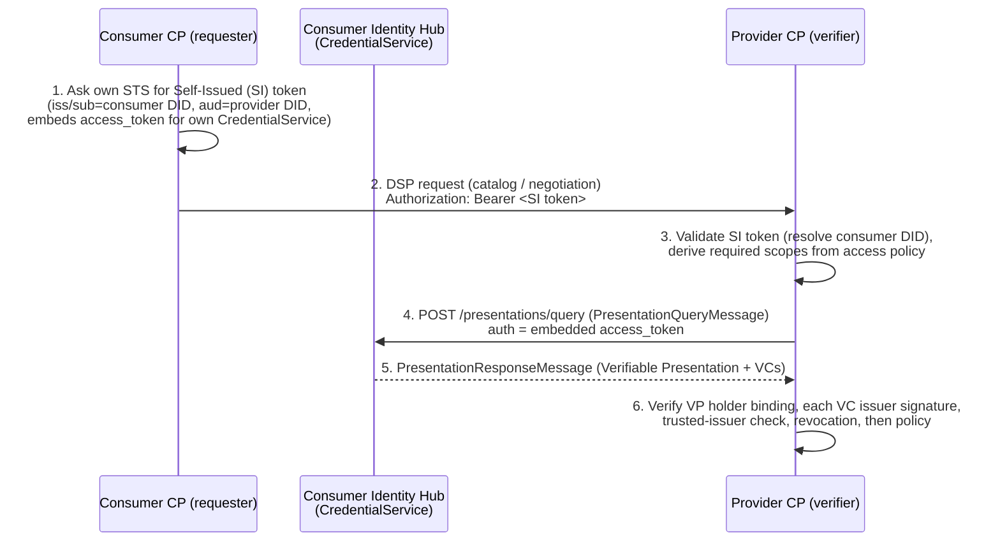
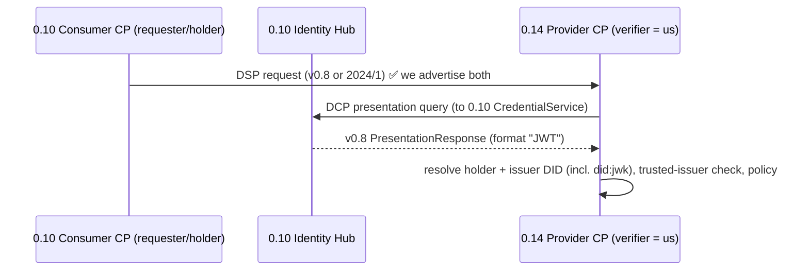
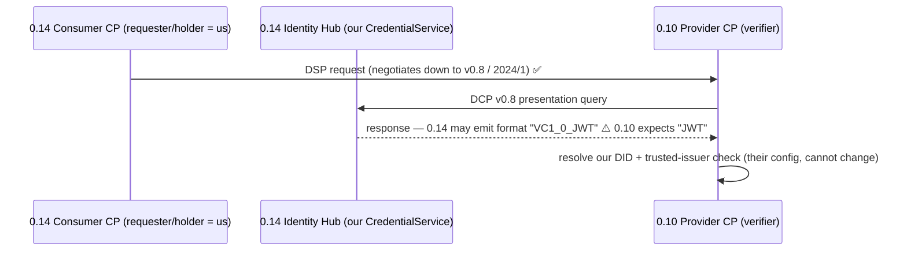

# Credential validation across an EDC 0.10 ⇄ 0.14 version boundary

**Status:** Specification / analysis
**Scope:** How Verifiable-Credential validation is initiated and completed between a
**frozen EDC 0.10 dataspace** (the "EMDS" side) and **our EONA-X connector on EDC 0.14**,
in both directions, **assuming no change can be made on the 0.10 side**.

All remediation described here lands on the **0.14 side only**.

> **Correction note (v2).** An earlier draft of this document claimed our 0.14 connector
> speaks only DSP `2025-1`, making the DSP transport a hard blocker. That was drawn from a
> partially-populated Gradle cache and is **wrong**. The resolved runtime classpath
> (authoritative) shows our control plane ships **all three DSP profiles — `v0.8`, `2024/1`,
> and `2025-1`** — so DSP transport is backward-compatible out of the box. The sections below
> reflect the corrected finding.

---

## 1. Constraint and what "initiating a validation" means

The 0.10 peer cannot be modified: not its DSP version, not its DCP context, not its
credential format, not its DID methods. Every adaptation is on our 0.14 connector.

In EDC, **credential validation is never a standalone call**. It is a side effect of a
Dataspace Protocol (DSP) interaction — catalog request, contract negotiation, or transfer.
The flow always has two roles:

- **Verifier (relying party):** the connector that receives a DSP request and must check
  the counterparty's credentials before proceeding.
- **Holder (prover):** the connector whose credentials are being checked. It exposes a
  **CredentialService Presentation API** (the Identity Hub) that the verifier calls back to.

So "a validation initiated from dataspace X to Y" means: **a participant in X opens a DSP
interaction toward Y**, which forces a credential exchange. The verifier is whichever side
*receives* the DSP request; the holder is whichever side *sent* it. Both sides typically
verify each other, so a single business interaction triggers validation in both directions.

### 1.1 The canonical EDC validation handshake (DCP presentation flow)

Two transport surfaces are involved and they are **independent**:

- **Hop 2** runs over **DSP** (connector-to-connector). Version-negotiated.
- **Hops 4/5** run over the **DCP presentation protocol**, verifier → the holder's
  **CredentialService** (Identity Hub), resolved from the holder's DID document — **not**
  through the DSP channel. Its wire version is therefore *not* tied to the negotiated DSP
  version.

The version-sensitive points are **2** (DSP transport), **4/5** (DCP context + credential
format), and **6** (DID resolution + trusted issuers).

---

## 2. Verified version facts

Everything in the "0.14 (our connector)" column was confirmed against the **resolved runtime
classpath** of this repository (`gradlew :launchers:control-plane:control-plane-base:dependencies`,
authoritative) and against published artifacts on Maven Central. `gradle.properties` pins
`edc = 0.14.0`. The "0.10" column reflects EDC 0.10 release behaviour and **must be confirmed
against the live EMDS deployment's DSP version-metadata endpoint** before implementation.

| Concern | EDC 0.10 (EMDS, frozen) | EDC 0.14 (our connector) — **verified** | Evidence (0.14) |
|---|---|---|---|
| DSP protocol versions | `v0.8` and/or `2024/1` | **`v0.8` + `2024/1` + `2025-1`, all three advertised** | runtimeClasspath carries the full `dsp-*-08`, `dsp-*-2024`, `dsp-*-2025` stacks (spi/core/http-api/transform/dispatcher); profile jars register `dataspace-protocol-http` (`/v0.8`), `:2024/1` (`/2024/1`), `:2025-1` (`/2025/1`) |
| DCP message context | `https://w3id.org/tractusx-trust/v0.8` | **bilingual, single module set**: carries both `tractusx-trust/v0.8` **and** `dspace-dcp/v1.0`; no `@Setting` selects between them | strings in `identity-trust-spi/core-0.14.0.jar`; `identity-trust-*` is not version-split |
| `CredentialFormat` enum | `JWT`, `JSON_LD` | `VC1_0_JWT`, `VC1_0_LD`, `VC2_0_JOSE`, `VC2_0_SD_JWT`, `VC2_0_COSE` — **no plain `JWT`** | `javap` on `verifiable-credentials-spi-0.14.0` |
| `VerifiableCredentialResource` model | `participantId`, `verifiableCredentialContainer` | `participantContextId`, `verifiableCredential`; adds `issuerId`/`holderId` | `javap` on `VerifiableCredentialResource` + `AbstractParticipantResource` |
| VC status code | `state: 500` = ISSUED | `state: 500` = `VcStatus.ISSUED` — **unchanged** | `javap -c VcStatus` → `ISSUED = 500` |
| DID methods on classpath | (per EMDS) `did:web`, issuer `did:jwk` | **`did:web` only** (`identity-did-web`); **no `did:jwk` resolver** | `gradle/libs.versions.toml:192` bundle `identity = [did-core, did-web]`; no jwk module in catalog or classpath |
| Trusted-issuer config | n/a | Control plane setting `edc.iam.trusted-issuer.<alias>.id=<did>` | `system-tests/modules/participant/controlplane.tf:73` |
| Presentation/Credential API | DCP v0.8 endpoints | CredentialService at `/api/credentials/v1/participants/{id}`; Identity API at `/v1alpha` | `identityhub.tf:18,63`; `AbstractEntity.java` |

**Maven Central availability of the backward DSP profiles:** `dsp-spi-2024`,
`dsp-http-api-configuration-2024`, `dsp-catalog/negotiation/transfer-*-2024`, and the `-08`
family all publish at **0.13.0 → 0.15.1** but are **dropped from 0.16.0 onward** (the 2025
variants continue). We are on **0.14.0**, comfortably inside that window — but this is a
constraint on any future EDC upgrade: past 0.15.1 the 0.10 backward bindings disappear.

**The corrected dominant fact:** DSP transport is **not** a blocker. Our 0.14 connector
advertises and accepts `v0.8`, `2024/1`, and `2025-1`, so a 0.10 peer that speaks `v0.8`
or `2024/1` negotiates a shared version automatically, in both directions. The residual
concerns are now all at the **DCP/credential layer** (hops 4/5/6): the credential-format enum
rename, the DCP context emitted on the out-of-band presentation exchange, DID resolution, and
trusted-issuer configuration.

---

## 3. Direction A — validation initiated **from the 0.10 dataspace to our 0.14 connector**

A 0.10 participant opens a DSP interaction toward our 0.14 connector (e.g. requests our
catalog or negotiates a contract). Our 0.14 connector is therefore the **verifier** of the
0.10 participant's credentials; the 0.10 participant is the **holder**.

| Hop | Compatibility | Why |
|---|---|---|
| 2 — DSP transport | ✅ **works** | We advertise `v0.8`/`2024/1`/`2025-1`; the 0.10 peer's version is among them. *Confirm the peer's advertised version.* |
| 4 — DCP query we send | ⚠️ **verify** | We are the verifier and must emit a query the 0.10 hub understands (v0.8 / `tractusx-trust`). 0.14 carries the v0.8 vocabulary; confirm it emits v0.8 (not v1.0) to this peer. |
| 5 — DCP response we parse | ✅ **expected to work** | 0.14 carries the v0.8 `PresentationResponseMessage` vocabulary and the legacy `JWT`/`JSON_LD` tokens on **inbound** parsing. |
| 6 — verification | ⚠️ **config (ours)** | We must (a) add a **`did:jwk` resolver** to resolve the EMDS issuer, and (b) register the EMDS issuer DID as a **trusted issuer**. |

**Net for Direction A:** achievable on our side alone. DSP connects out of the box; we add a
`did:jwk` resolver and a trusted-issuer entry, and confirm the v0.8 DCP exchange end-to-end.

---

## 4. Direction B — validation initiated **from our 0.14 connector to the 0.10 dataspace**

Our 0.14 connector opens a DSP interaction toward a 0.10 provider (e.g. we consume their
data). The 0.10 provider is the **verifier**; our 0.14 connector is the **holder**, exposing
its Identity Hub Presentation API to the 0.10 verifier.

| Hop | Compatibility | Why |
|---|---|---|
| 2 — DSP transport | ✅ **works** | We negotiate down to the 0.10 peer's `v0.8`/`2024/1`. |
| 4 — DCP query we receive | ✅ **expected to work** | Our Presentation API parses the inbound v0.8 query (0.14 carries v0.8 vocabulary). |
| 5 — DCP response we emit | ⚠️ **verify / possible shim** | As holder, 0.14 serialises the response with the **new** `CredentialFormat` token `VC1_0_JWT` and may stamp the `dspace-dcp/v1.0` envelope. A frozen 0.10 verifier expects `JWT` and the v0.8 envelope. If 0.14 does not auto-down-render for a v0.8 query, we need a **down-rendering interceptor** on the response path. |
| 6 — verification | ⛔ **on the 0.10 side** | The 0.10 provider resolves *our* DID and checks *its* trusted-issuer list. We cannot change that config. Our credentials must therefore be issued by an issuer the 0.10 side already trusts, on a DID method it can already resolve (`did:web`). |

**Net for Direction B:** harder than A, but the gap narrowed. DSP connects out of the box.
The remaining risks are (i) whether our outbound presentation renders in the v0.8 shape the
0.10 verifier accepts (verify; shim if not), and (ii) trust we cannot grant ourselves on the
frozen 0.10 side — our presented credentials must already be issuer/DID-acceptable there.

---

## 5. Consolidated compatibility matrix

| Layer | A: 0.10→0.14 (we verify) | B: 0.14→0.10 (we are verified) |
|---|---|---|
| DSP transport (hop 2) | ✅ built in (confirm peer version) | ✅ built in (confirm peer version) |
| DCP message context (v0.8 ⇄ v1.0) | ⚠️ verify v0.8 outbound query | ✅ inbound parse / ⚠️ v0.8 outbound response |
| Credential format token | ✅ parse legacy inbound | ⚠️ emit legacy `JWT` outbound (verify; shim if needed) |
| DID resolution | ⚠️ add `did:jwk` resolver (ours) | ⛔ governed by frozen 0.10 config |
| Trusted issuers | ⚠️ add EMDS issuer (ours) | ⛔ governed by frozen 0.10 config |
| VC resource ingestion (manual) | ⚠️ field renames (§7) | n/a |

Legend: ✅ works as-is · ⚠️ fixable/verifiable on our 0.14 side · ⛔ depends on the frozen 0.10 side.

---

## 6. Remediation on the 0.14 side (0.10 frozen)

### 6.1 DSP transport — no action required ✅
Our 0.14 control plane already ships the `v0.8`, `2024/1`, and `2025-1` DSP profiles and
advertises all three at its version-metadata endpoint. A 0.10 peer negotiates a shared
version automatically. **The only task here is to confirm** which version the live EMDS
connector advertises (expected `v0.8` or `2024/1`) and that the negotiated handshake
succeeds end-to-end. No compatibility module needs adding — they are present out of the box
at 0.14.0. *(Caveat for future upgrades: the `2024/1` and `v0.8` profile modules are removed
from EDC 0.16.0 onward.)*

### 6.2 DCP context selection (hops 4/5)
The DCP presentation exchange is a single bilingual module set with no config switch. Verify
on a live handshake that, against a v0.8 peer, 0.14 emits the `tractusx-trust/v0.8`
context for both the outbound query (Direction A) and the outbound response (Direction B). If
it defaults to `dspace-dcp/v1.0` and the 0.10 peer rejects it, introduce a per-peer profile
selector or a JSON-LD context rewrite on the presentation path.

### 6.3 Credential-format down-rendering (Direction B, verify first)
When our 0.14 hub responds as holder to a v0.8 query, confirm whether the credential-format
token is emitted as legacy `JWT`/`JSON_LD` or as `VC1_0_JWT`/`VC1_0_LD`. If the latter, add a
transformer/interceptor on the presentation-response path to down-render the token for v0.8
peers. (Internal storage keeps the new enum regardless — see §7.)

### 6.4 DID resolution + trust (Direction A)
- Add a **`did:jwk` resolver** extension to the control-plane (and Identity Hub) runtimes;
  only `did:web` is on the classpath today.
- Register the EMDS issuer as trusted:
  `edc.iam.trusted-issuer.emds.id=did:jwk:eyJrdHkiOiJFQyIsImNydiI6InNlY3AyNTZrMSIs...`

### 6.5 Our own credentials (Direction B, on the frozen 0.10 side)
Because the 0.10 verifier's DID resolution and trusted-issuer list cannot change, the
credentials our connector presents must be issued by an issuer the 0.10 side **already
trusts**, bound to a DID method it can **already resolve** (`did:web`). If that is not already
the case, Direction B cannot be made to work by us alone — it needs a governance decision on
the (otherwise frozen) 0.10 side, which is out of scope of this constraint.

---

## 7. Manual VC-resource ingestion (companion to §6.4)

If EMDS hands us a serialized `VerifiableCredentialResource` for direct insertion via the
Identity API (`POST /api/identity/v1alpha/participants/{participantContextId}/credentials`)
rather than via a DCP issuance flow, the 0.10 JSON must be rewritten to the 0.14 model:

| 0.10 field | 0.14 field | Note |
|---|---|---|
| `"format": "JWT"` | `"format": "VC1_0_JWT"` | enum rename (§2) |
| `"participantId"` | `"participantContextId"` | model rename |
| `"verifiableCredentialContainer"` | `"verifiableCredential"` | model rename |
| `"state": 500` | `"state": 500` | unchanged (ISSUED) |
| holder/subject `did:web:test.com` | our connector's real DID | placeholder in the EMDS sample |

DCP issuance (EMDS Issuer Service pushes to our CredentialService) is preferable to manual
insertion for anything beyond a first integration test.

---

## 8. Recommendation

1. **Run a live handshake first.** DSP transport works out of the box, so stand up the 0.14
   connector against the EMDS 0.10 peer and observe a catalog/negotiation round-trip. This
   immediately settles the only genuinely uncertain items (§6.2/§6.3): which DCP context and
   credential-format token cross the wire.
2. **Direction A is achievable on our side alone:** `did:jwk` resolver + trusted-issuer entry
   (§6.4), plus whatever §6.2 the handshake reveals. Target this first.
3. **Direction B** additionally depends on (i) our outbound presentation rendering in the
   v0.8 shape (verify; shim per §6.3 if needed) and (ii) the EMDS-side trust/DID config we
   cannot change. Treat as a second phase.

---

## 9. Open items to confirm

- [x] **Does EDC 0.14 ship a `2024/1` (and `v0.8`) DSP compatibility module set?** —
      **Confirmed YES.** The `dsp-*-2024` and `dsp-*-08` stacks are on our resolved runtime
      classpath and published on Maven Central for 0.13.0–0.15.1 (removed at 0.16.0). DSP
      transport is backward-compatible out of the box; no bridge needed.
- [ ] DSP version the **live EMDS 0.10** connector advertises (expect `v0.8` or `2024/1`),
      via its version-metadata endpoint.
- [ ] On a live handshake, which **DCP context** (`tractusx-trust/v0.8` vs `dspace-dcp/v1.0`)
      and which **credential-format token** (`JWT` vs `VC1_0_JWT`) our 0.14 connector emits to
      a v0.8 peer — determines whether §6.2/§6.3 shims are needed.
- [ ] Whether our connector's presented credentials are issued by an issuer/DID the frozen
      0.10 side already trusts and can resolve (Direction B gate).
